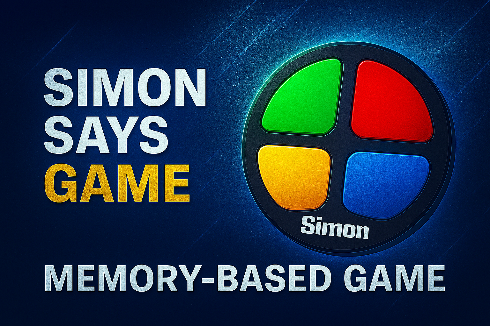
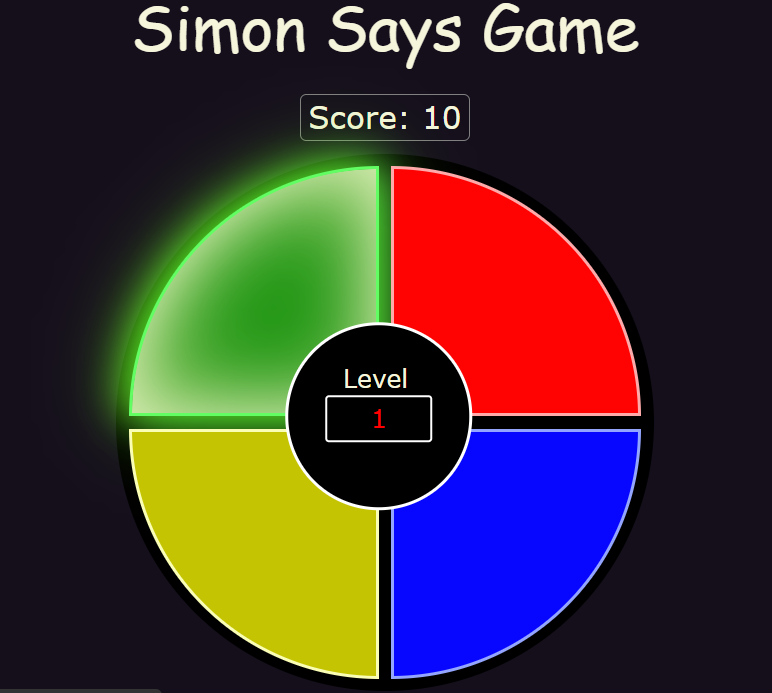
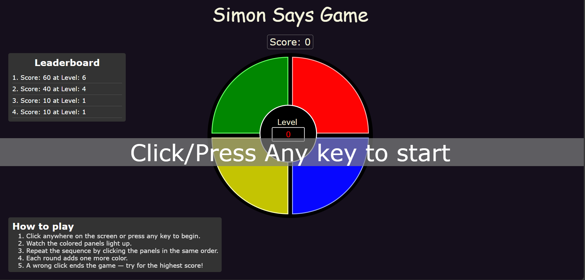

# simonsays-game

A dynamic, **browser-based memory game** inspired by the classic _Simon Says_ — built to challenge your pattern recognition, memory, and speed!
Test your memory by repeating randomly generated color sequences. Each level adds complexity, and one mistake resets your progress.

## 🌐 Live Demo

🔗 [👉Play now](https://shashanksaurav-lab.github.io/simonsays-game/)

## 🚀 Features

1. 🏆 **Leaderboard:** Tracks top scores across sessions using local storage.
2. ⭐ **Interactive Gameplay:** Button animations enhance visual interactivity.
3. 🖥️ **Responsive design:** Optimized for desktop and mobile devices.
4. 🎶 **Sound cues:** Audio feedback for clicks, level-ups, and game overs.
5. 🎲 **Randomized sequences:** Each level introduces a new pattern.
6. 🔁 **Restart flow:** One tap or keypress to play again instantly.
7. 🔧 **Clean codebase:** Modular, readable JavaScript structure.

## 🛠️ Tech Stack

  
– Structured, semantic layout.

  
– Attractive styles, responsive layouts, smooth transitions.

  
– Game logic, state management, interactivity.

  
– Leaderboard persistence across sessions.

## 🎯 Why Simon Says?

I built this project to solidify my knowledge of **frontend development**, including:

- DOM manipulation and event handling
- Game loop and state management techniques
- UI/UX best practices
- Responsive and accessible design principles

## 📸 Screenshots

| Custom Thumbnail                  | Game Interface                          |
| --------------------------------- | --------------------------------------- |
|  |  |

## 📬 Feedback & Contributions

Open to suggestions, issues, and pull requests! Let’s make memory games great again.
